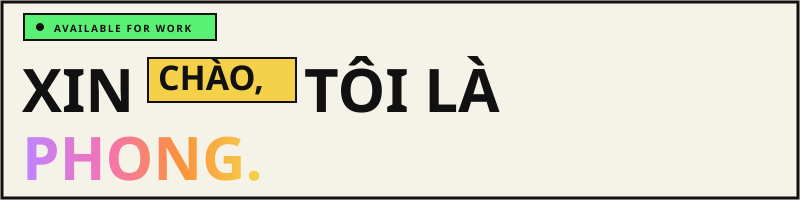

 

*Fresher developer — code by day, research by night, deploy anytime.*

*Code frontend. Build backend. Deploy blockchain.*

 

---

## Dự án tiêu biểu

> ### 🌿 VietFresh &nbsp;&nbsp;
> 
> 
> 
>
> Nền tảng thương mại nông sản Việt, phát triển trong kỳ thực tập tại **GNN Software**.  
> Ứng dụng công nghệ **Blockchain** nhằm đảm bảo truy xuất nguồn gốc minh bạch, nâng cao độ tin cậy trong chuỗi cung ứng.
>
> **Tech stack:** React.js, TailwindCSS, Node.js, Express.js, MongoDB, Solidity, Ethereum, Vercel, Render, Cloudinary
>
> 🔗 https://vietfresh-offical.vercel.app/

> ### ⛓️ Supply Chain on Blockchain &nbsp;&nbsp;
> 
> 
> 
> 
>
> Xây dựng hệ thống truy xuất nguồn gốc chuỗi cung ứng trên blockchain **Sui** trong **48 giờ**.
>
- Smart Contract: Phát triển bằng **Sui Move**
- AI Agent: Xây dựng AI Agent để trích xuất thông tin từ chứng từ logistics và tự động điền dữ liệu vào các biểu mẫu nghiệp vụ.
- Backend: Phát triển API và xử lý nghiệp vụ bằng **Node.js**.
- Frontend: Xây dựng giao diện người dùng bằng **Next.js**.
>
> 🔗 https://github.com/phongnhd/global-supply-chain
>
> ### 🍕 Pizza Ordering Website &nbsp;&nbsp;
> 
> 
>
> Phát triển giao diện website đặt pizza hiện đại, responsive với trải nghiệm người dùng mượt mà trên nhiều thiết bị.
>
> **Tech stack:** React.js, Tailwind CSS, JavaScript, Vite, Vercel
>
> - Xây dựng giao diện responsive bằng **React.js** và **Tailwind CSS**.
> - Tối ưu hiệu năng với **Lazy Loading**, **Code Splitting** và chỉ tải nội dung khi người dùng cuộn đến khu vực tương ứng (Viewport-based Loading).
> - Thiết kế UI trực quan, đảm bảo trải nghiệm nhất quán trên desktop và mobile.
>
> 🔗 https://pizza-tp-drab.vercel.app/

---

##  Công nghệ sử dụng

**Frontend**

**Backend & DB**

**Web3**

**Tools**

---

*"I don't just write code — I design logic."*

